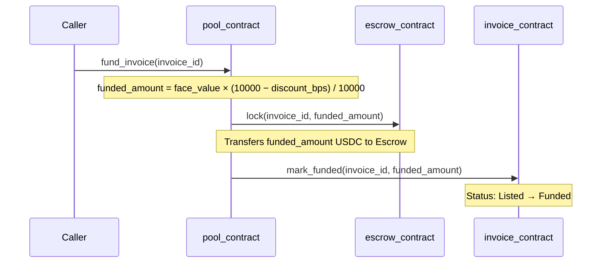
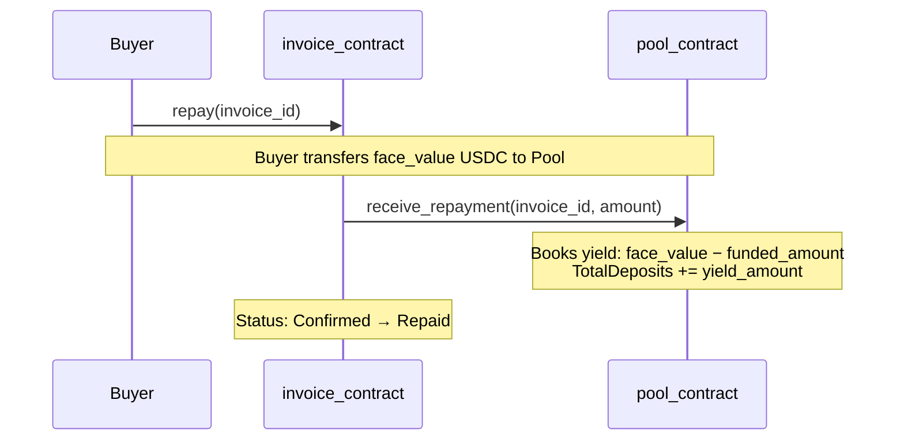
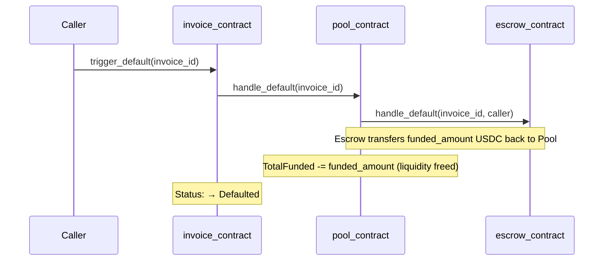

<p align="center">
  
</p>

<h1 align="center">TrusTrove — Smart Contracts</h1>

<p align="center">
  Four Soroban smart contracts powering the TrusTrove trade finance protocol on Stellar.
</p>

<p align="center">
  <a href="https://github.com/TrusTrove/TrusTrove-contract/actions/workflows/ci.yml">
    
  </a>
  
  
  
  
</p>

<p align="center">
  <a href="https://trustrove.vercel.app">Live App</a> ·
  <a href="https://github.com/TrusTrove/TrusTrove-app">App Repo</a> ·
  <a href="https://stellar.expert/explorer/testnet">Stellar Explorer</a>
</p>

---

## What is TrusTrove?

TrusTrove is a decentralized trade finance protocol on Stellar. SMEs tokenize unpaid invoices and receive immediate USDC funding from a shared liquidity pool. Liquidity providers deposit USDC and earn yield from discount fees when invoices repay. No banks, no brokers — four Soroban smart contracts handle everything.

---

## Maintainers

| | Name | Role | GitHub | Telegram |
|---|---|---|---|---|
| | **Fuhad (K1NGD4VID)** | Founder & Lead Developer | [@k1ngd4vid](https://github.com/k1ngd4vid) | [@k1ngd4vid](https://t.me/k1ngd4vid) |

Join the contributor community: **[t.me/trusttrove](https://t.me/trusttrove)**

---

## Contracts

### registry_contract

Tracks verified SME issuers and buyers. Every other contract calls `is_verified()` before allowing any action.

```
initialize(admin)
register_issuer(address, metadata) → bool
register_buyer(address, metadata) → bool
is_verified(address) → bool
get_profile(address) → Profile
revoke(address) → bool
```

### invoice_contract

Manages the full invoice lifecycle. Enforces valid state transitions. Emits events consumed by the Go indexer.

```
Created → Listed → Funded → Active → Confirmed → Repaid
                                    ↘ Defaulted
```

```
create(issuer, buyer, face_value, due_date) → invoice_id
list_for_financing(invoice_id, discount_bps) → bool
mark_funded(invoice_id, funded_amount) → bool   ← pool_contract only
mark_shipped(invoice_id) → bool
confirm_delivery(invoice_id, confirmer) → bool  ← dual confirmation required
repay(invoice_id) → bool
trigger_default(invoice_id) → bool
get(invoice_id) → Invoice
get_by_status(status) → Vec<Invoice>
get_by_issuer(address) → Vec<Invoice>
```

### escrow_contract

Holds USDC between pool funding and issuer payout. Only callable by `pool_contract`.

```
lock(invoice_id, amount) → bool
release_to_issuer(invoice_id, issuer) → bool
release_to_pool(invoice_id, repayment_amount) → bool
handle_default(invoice_id, caller) → bool   ← admin or pool_contract
get_locked(invoice_id) → u128
```

### pool_contract

USDC liquidity pool with share-based LP accounting. Share price grows as invoices repay.

```
deposit(lp, usdc_amount) → shares
withdraw(lp, shares) → usdc_amount
fund_invoice(invoice_id) → bool
receive_repayment(invoice_id, amount) → bool  ← invoice_contract only
handle_default(invoice_id) → bool
get_stats() → PoolStats
get_lp_position(address) → LPPosition
```

---

## Architecture & Fund Flow

### Contract Interaction Map

```
                    ┌─────────────────┐
                    │  registry_contract │
                    │  (identity oracle) │
                    └────────┬────────┘
                             │ is_verified()
          ┌──────────────────▼──────────────────┐
          │           invoice_contract            │
          │  (lifecycle state machine & indexer)  │
          └──────┬────────────────────┬──────────┘
                 │ mark_funded()      │ receive_repayment()
                 │ trigger_default()  │ handle_default()
          ┌──────▼───────┐    ┌───────▼──────────┐
          │ pool_contract │    │  pool_contract   │
          │  fund_invoice │    │  (repayment in)  │
          └──────┬────────┘    └──────────────────┘
                 │ lock()
          ┌──────▼────────────┐
          │  escrow_contract  │
          │  (USDC custody)   │
          └───────────────────┘
```

### Invoice Lifecycle & Fund Movement

Each step below documents what happens to USDC and which contracts are called.

#### Step 1 — Liquidity Provision (LP → Pool)
LPs deposit USDC into the pool and receive shares proportional to their contribution. Share price grows as invoices repay.

```
LP ──[USDC]──► Pool
Pool ──[shares]──► LP
```

#### Step 2 — Create & List (no funds move)
The issuer creates an invoice (recording `face_value`, `due_date`, `buyer`, `funding_asset`), then lists it with a `discount_bps` expressing the yield they will give up in exchange for immediate liquidity.

```
No fund movement. Invoice status: Created → Listed.
```

#### Step 3 — Fund Invoice (Pool → Escrow)
Anyone can call `pool.fund_invoice(invoice_id)`. The pool computes the funded amount, locks it in escrow, and marks the invoice as funded.



The pool retains `face_value − funded_amount` (the discount) as accrued yield, collectible when the buyer repays.

#### Step 4 — Release to Issuer (Escrow → Issuer) ⚠️ Known Gap
The pool contract is expected to call `escrow.release_to_issuer(invoice_id, issuer)` so that the locked USDC reaches the issuer who can then ship goods.

```
Escrow ──[funded_amount USDC]──► Issuer
```

**⚠️ This call is not yet wired into `fund_invoice` (see [Issue #56](https://github.com/TrusTrove/TrusTrove-contract/issues/56)).** In the current deployment, issuers do not automatically receive USDC after an invoice is funded. This is the highest-priority gap before mainnet.

#### Step 5 — Ship & Confirm (no funds move)
The issuer calls `mark_shipped`. Then **both** the issuer and the buyer must independently call `confirm_delivery`. Only when both confirmations are recorded does the invoice advance to `Confirmed`.

```
No fund movement. Invoice status: Funded → Active → Confirmed.
```

#### Step 6 — Repay (Buyer → Pool, bypassing Escrow)
The buyer calls `invoice.repay(invoice_id)`, which transfers `face_value` USDC **directly from the buyer to the pool**, then calls `pool.receive_repayment` to account for the yield.



Repayment does **not** flow through escrow. The escrow contract is only involved in funding (Step 3), the missing issuer release (Step 4), and default recovery (Step 7).

#### Step 7 — Default (Escrow → Pool)
If the invoice passes its `due_date` without reaching `Repaid`, any caller triggers `invoice.trigger_default`. The invoice contract calls `pool.handle_default`, which in turn calls `escrow.handle_default` — returning the still-locked `funded_amount` to the pool.



### Summary Table

| Event | Source | Destination | Amount | Escrow involved? |
|---|---|---|---|---|
| LP deposit | LP wallet | Pool | `usdc_amount` | No |
| LP withdraw | Pool | LP wallet | `shares × price` | No |
| Fund invoice | Pool | Escrow | `face_value × (1 − discount)` | Yes — locks |
| Release to issuer *(gap)* | Escrow | Issuer | `funded_amount` | Yes — releases |
| Repay | Buyer wallet | Pool | `face_value` | No |
| Default recovery | Escrow | Pool | `funded_amount` | Yes — releases |

### Security Invariants

- The escrow contract only accepts `lock()` calls from the registered `pool_contract`.
- `release_to_issuer` and `release_to_pool` are callable only by `pool_contract`.
- `handle_default` in escrow accepts the pool or the admin (emergency recovery path).
- `receive_repayment` in the pool is callable only by the registered `invoice_contract`.
- Every state transition in `invoice_contract` is guarded by an explicit status check; no skipping steps.

---

## Deployed Contracts (Stellar Testnet)

| Contract | Address |
|----------|---------|
| registry_contract | `CABGWVIZFF62FG67ZGFEP67NEEY4WYTMFURDMFTKKNRDAFPKPOJDTN4C` |
| invoice_contract | `CA4O3MR7LWHRSUDBNU6FY6UDFFYBN7TGBZXBDZB4OYYXFYXIFJ6RJF6B` |
| escrow_contract | `CAJWGUKDTTC3SKN4RAAY72J4DVIIYSCFHX6GIMNTT22ABMISJK4GBCEH` |
| pool_contract | `CAKEWH7SJCXGV2MH2WZYIX3QDPTSSBQFXYVYBOWAGLNBBZMPLE2US6CS` |

Verify on [Stellar Expert Testnet](https://stellar.expert/explorer/testnet)

---

## Quick Start

### Prerequisites

- Rust 1.85.0 (required — other versions either have WASM bugs or are blocked by Stellar CLI)
- [Stellar CLI](https://github.com/stellar/stellar-cli) (latest)

### 1. Install Rust 1.85.0

```bash
rustup toolchain install 1.85.0
rustup target add wasm32v1-none --toolchain 1.85.0
```

### 2. Clone and build

```bash
git clone https://github.com/TrusTrove/TrusTrove-contract.git
cd TrusTrove-contract
rustup run 1.85.0 stellar contract build
```

### 3. Run tests

```bash
cargo test --workspace
```

### 4. Deploy to testnet

```bash
# Create and fund a deployer account
bash scripts/setup-testnet.sh

# Fund via browser: https://friendbot.stellar.org/?addr=YOUR_ADDRESS

# Deploy all four contracts
bash scripts/deploy.sh
```

The deploy script prints all four contract IDs at the end. Paste them into `TrusTrove-app/.env.local`.

---

## Known Centralization Risks & Roadmap

TrusTrove is in active development on Stellar testnet. Several centralization trade-offs were made deliberately to ship a working protocol quickly. They are documented here so contributors and users understand the current trust model and can help drive the path to a more decentralized design.

### Admin key controls critical operations

The deployer wallet that calls `initialize()` on each contract becomes its `admin`. That single key currently controls:

- Registering and revoking verified issuers/buyers (`registry_contract`)
- Emergency pausing (not yet implemented — see roadmap below)
- Triggering `handle_default` as a fallback recovery path (`escrow_contract`)

**Risk:** Loss or compromise of the admin key has a high blast radius. A single actor also introduces censorship risk for issuer onboarding.

**Roadmap:** Migrate admin to a multi-sig (e.g., 3-of-5 Stellar signers) before any mainnet deployment.

### `fund_invoice` was previously admin-gated

Prior to this change, `pool::fund_invoice` required `admin.require_auth()`, meaning capital allocation was entirely at the admin's discretion. This created censorship risk — the admin could favour certain issuers, block competitors, or halt funding entirely with no on-chain accountability.

**Current state (this release):** `fund_invoice` is now **permissionless**. Any caller can trigger funding for any invoice that passes the on-chain eligibility checks:
1. Invoice status must be `Listed` (status 1)
2. Invoice funding asset must match the pool's asset
3. Pool must have sufficient available liquidity

No off-chain approval or admin signature is required.

**Longer-term governance design (not yet implemented):**

The goal is LP-governed capital allocation:

- LPs stake their LP tokens to signal approval for specific invoices ("LP voting")
- An invoice becomes eligible once a quorum of LP-weighted votes approves it
- Admin retains only an emergency pause capability (circuit breaker), not funding control
- Governance parameters (quorum threshold, voting window) are upgradeable by LP vote

If you want to contribute to governance design, open an issue tagged `complexity:high` and link your proposal.

### No emergency pause mechanism

There is currently no circuit breaker. If a critical bug is found post-deployment the only recourse is to stop directing traffic to the affected contracts via the frontend.

**Roadmap:** Add an `admin_pause() / admin_unpause()` function pair to each contract, guarded behind multi-sig, that blocks state-changing calls while reads remain live.

---

## Contributing

We welcome contributions from Rust and Soroban developers. Read [CONTRIBUTING.md](./CONTRIBUTING.md) before opening a PR.

### Find an issue

Issues are labeled by contract and complexity:
- `complexity:low` — isolated function or test, good entry point
- `complexity:medium` — touches contract logic and storage
- `complexity:high` — cross-contract interactions or new mechanics

### Key conventions

- All amounts use `u128` in stroops (1 USDC = 10,000,000)
- All timestamps use `u64` Unix seconds
- Every `persistent().set()` must be followed by `extend_ttl()`
- Use `panic_with_error!` with typed errors — no bare `panic!` or `unwrap()` in production paths

### Commit format

```
feat(registry): add batch issuer registration function
fix(pool): guard against division by zero when total_shares is 0
test(invoice): add full lifecycle integration test
```

If you have questions, reach us on Telegram: **[t.me/trusttrove](https://t.me/trusttrove)**

---

## License

MIT

---

## Contributors

[](https://github.com/TrusTrove/TrusTrove-contract/graphs/contributors)
